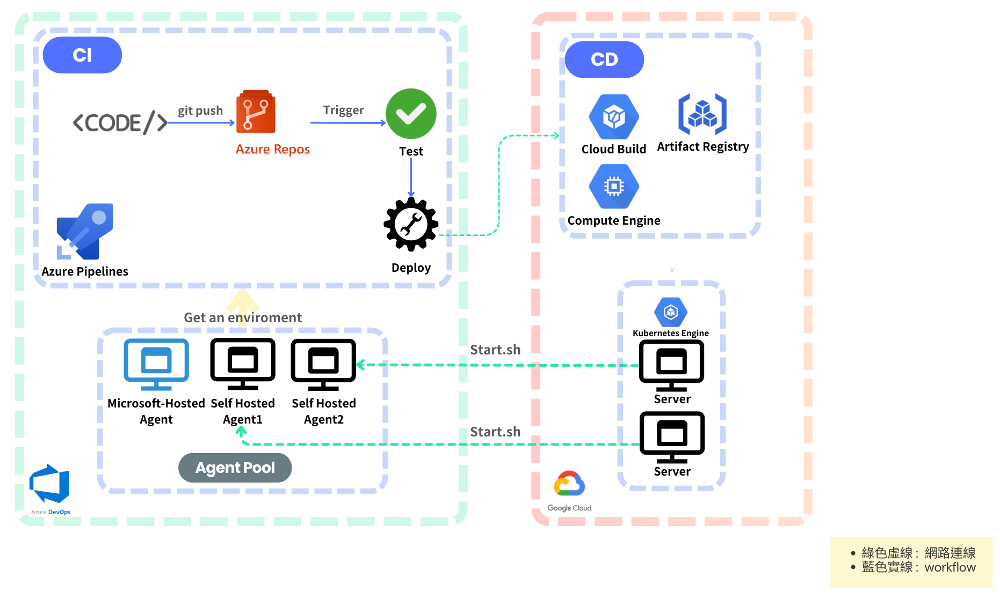

# Azure pipelines Use Self-host Image

希望Azure Pipelines可以使用我們預設的環境(Dockerfile)

因為Azure Pipelines Default的Agent是 Microsoft-host Agent(該Agent在每次執行時都會重新清環境)

所以執行CICD時 出現 "Command Not Found"(EX: Dagster , dbt..etc) 

## Architecture
  
  

## Build Self-host agent for Azure pipelines
- Create agent-pool
   
   UI -> Project Setting -> Agebt Pools > New Agent Pool

- Dockerfile -> azp-agent-linux/dockerfile

- Build Image (*注意* 將dockerfile內容修改為自己希望的環境)

``` bash
docker build --tag "azp-agent:linux" --file "./azp-agent-linux.dockerfile" .
```
- Docker push to Google Artifact Registry

``` bash
docker push "${HOSTNAME}/${PROJECT_ID}/${REPOSITORY}/${IMAGE}:${TAG}"
```

- Run self-host agent in a Docker

``` bash
docker run -e AZP_URL=${AZP_URL} -e AZP_TOKEN="${AZP_TOKEN} -e AZP_POOL=${AZP_POOL} -e AZP_AGENT_NAME=${AZP_AGENT_NAME} --name "azp-agent-linux" azp-agent:linux
```

*註* : AZP_TOKEN 最長久僅一年 , 修改agent_info中的 Token即可

- Azure Pipelines Yaml

``` yaml
trigger:
- master

pool:
  name: <pool_name>
  vmImage: <agent_name>

steps:
- script: echo Hello, world!
  displayName: 'Run a one-line script'
```

## Self-host agent deploy on kubernetes

既然有了 Image 當然也可以部署在 Kubernetes上。
以提升這個Agent他的 Scalability , Flexibility 
或是因應效能提升其資源調度(resources request)。

檢視 /deploy Yaml

- Pod or deployment.yaml
- Make your variables in kubernetes secret

## Refence 

[Azure-self-host-agent](https://learn.microsoft.com/en-us/azure/devops/pipelines/agents/agents?view=azure-devops&tabs=yaml,browser)

[Azure-self-host-agent-on-Docker](https://learn.microsoft.com/en-us/azure/devops/pipelines/agents/docker?view=azure-devops)

[Azure-self-host-agent-on-Kubernetes](https://medium.com/@muppedaanvesh/azure-devops-self-hosted-agents-on-kubernetes-part-1-aa91e7912f79)